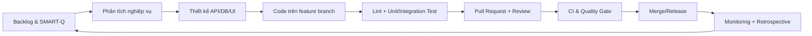

# Quy trình SDLC FitLife theo ETVX

| Bước | Entry | Task | Verification | Exit | Vai trò chính |
|---|---|---|---|---|---|
| Lập kế hoạch | Yêu cầu thầy, feedback người dùng | Viết backlog, ưu tiên, SMART-Q | Product Owner kiểm tra acceptance criteria | Sprint backlog được duyệt | PO/PM |
| Phân tích | User story đã ưu tiên | Luồng gym, quyền, rủi ro | Review nghiệp vụ | API contract và rule rõ ràng | BA + Dev |
| Thiết kế | Contract đã duyệt | Kiến trúc, DB, UI, test design | Design review | Thiết kế có thể code/test | Tech Lead |
| Phát triển | Task có DoD | Code, unit test, cập nhật docs | Lint local | Branch sẵn sàng PR | Developer |
| Kiểm thử | Build thành công | Jest/Supertest, regression, build | Coverage gate | Không còn lỗi blocker | QA |
| Review/Merge | PR đầy đủ checklist | Peer review và sửa feedback | CI + Sonar gate | 1 approval và gate xanh | Reviewer |
| Vận hành | Bản release | Logs, Prometheus, Grafana, SLO | Theo dõi error/latency | Dữ liệu cho retro | DevOps/QA |
| Cải tiến | Metrics và incident | PDCA/ODA | So sánh trước–sau | Action item có owner/deadline | Cả nhóm |

## Vai trò nhóm 3 người

- Người 1: Backend core, database, integration.
- Người 2: Frontend, UX, workflow hội viên.
- Người 3: QA/SPQM, CI, SonarQube, Docker, monitoring và tài liệu.
- Mọi PR phải được ít nhất một người không phải tác giả review.
